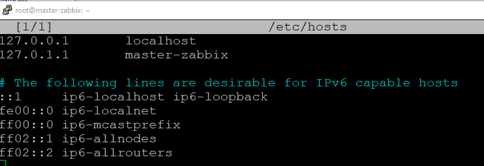
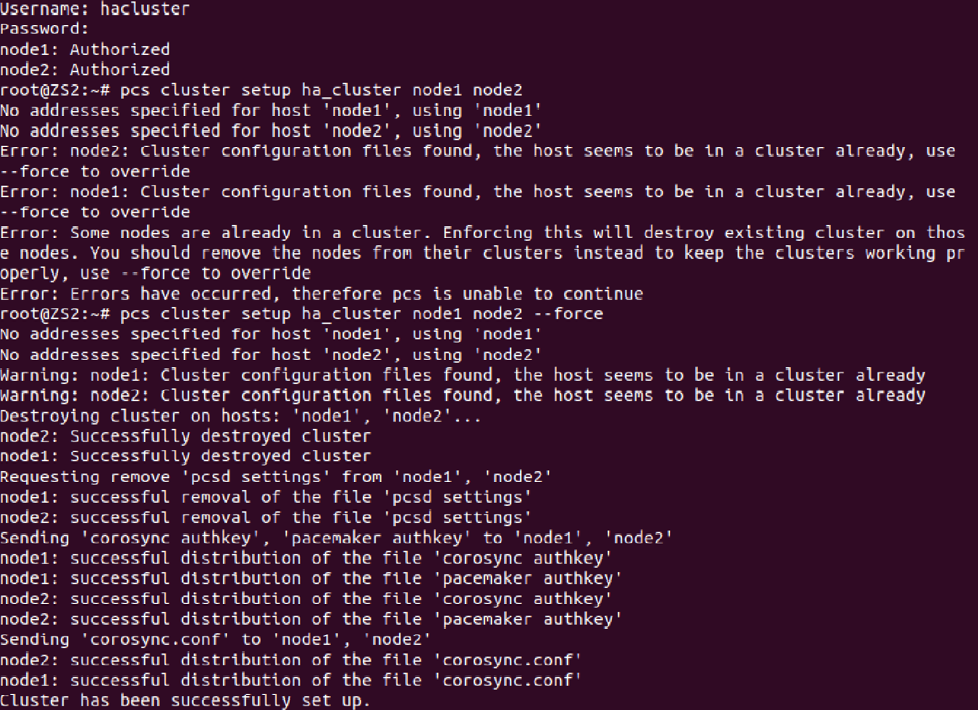
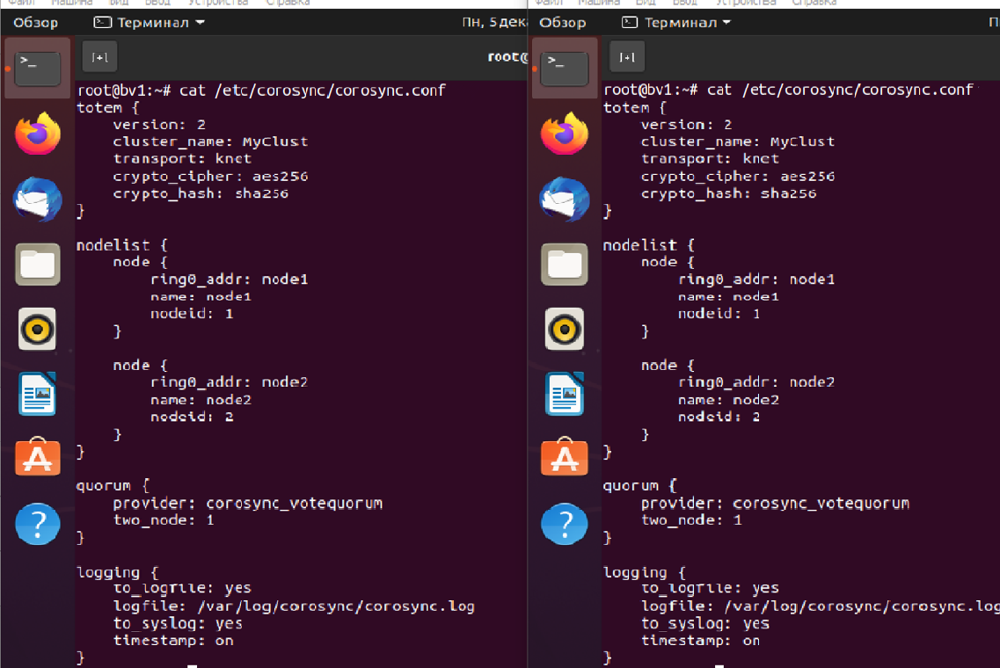
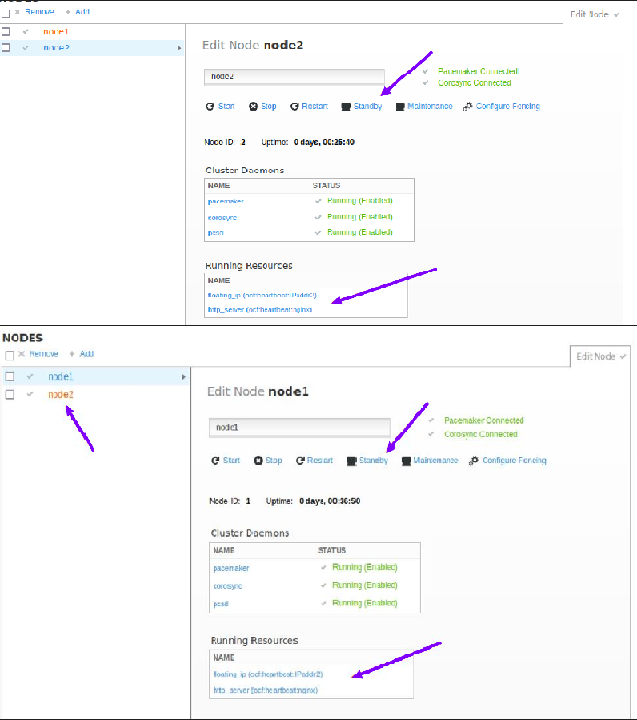
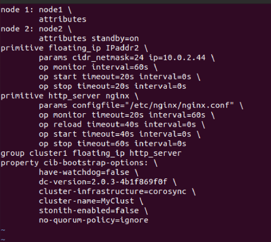

# Домашнее задание к занятию 10.3 «Pacemaker»

---

### Задание 1

Опишите основные функции и назначение Pacemaker.

*Приведите ответ в свободной форме.*

Согласно официальной документации, Pacemaker — это менеджер ресурсов кластера со следующими основными фичами:
Обнаружение и восстановление сбоев на уровне узлов и сервисов;
Независимость от подсистемы хранения: общий диск не требуется;
Независимость от типов ресурсов: все что может быть заскриптовано, может быть кластеризовано;
Поддержка STONITH (Shoot-The-Other-Node-In-The-Head) — лекарства от Split-Brain ;);
Поддержка кластеров любого размера;
Поддержка и кворумных и ресурсозависимых кластеров;
Поддержка практически любой избыточной конфигурации;
Автоматическая репликация конфига на все узлы кластера;
Возможность задания порядка запуска ресурсов, а также их совместимости на одном узле;
Поддержка расширенных типов ресурсов: клонов (запущен на множестве узлов) и с дополнительными состояниями (master/slave и т.п.);
Единый кластерный шелл (crm), унифицированный, скриптующийся

---

### Задание 2

Опишите основные функции и назначение Corosync.

*Приведите ответ в свободной форме.*

— программный продукт, позволяющий реализовать кластер
серверов. Его основное назначение — знать и передавать
состояние всех участников кластера.
В основе работы заложены следующие функции:
отслеживание состояния приложений;
оповещение приложений о смене активной ноды кластера;
отправка одинаковых сообщений процессам на всех узлах
кластера;
предоставление доступа к базе данных с конфигурацией и
статистикой, а также отправка уведомлений о ее изменениях.

---

### Задание 3

Соберите модель, состоящую из двух виртуальных машин. Установите Pacemaker, Corosync, Pcs. Настройте HA кластер.

*Пришлите скриншот рабочей конфигурации и состояния сервиса для каждого нода.*

---